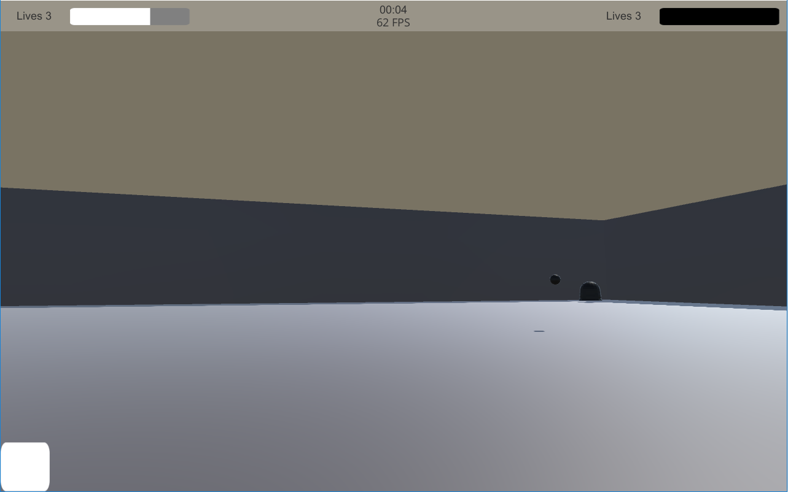

Shoot The Jelly
======

Shoot The Jelly is a FPS game made for the [OneGameAMonth](http://www.onegameamonth.com/) gamejam in october 2016.

I used Unity 5.4.1 Personal. I also made the enemy model with Blender and the sound effects with [ChipTone](sfbgames.com/chiptone/).
